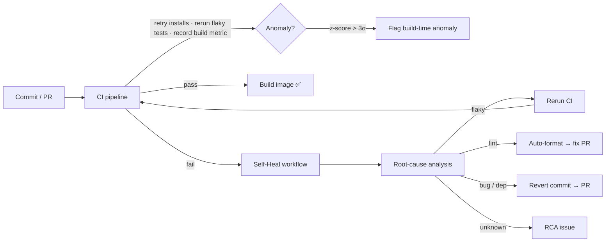

# 🔁 Self-Healing CI/CD Pipeline

An autonomous build-and-deploy pipeline that **detects, diagnoses, and remediates its own failures** — no human in the loop. Built as a live demo of self-healing CI/CD.

When a build breaks, the pipeline pulls the failed logs, runs root-cause analysis, and picks a remediation strategy on its own: retry the flake, auto-format the lint error, or revert the culprit commit — and files an RCA issue every time.

## The three-strategy healing model

| Failure kind | RCA category | Automated action |
| --- | --- | --- |
| Transient / flaky / network | `flaky` | **Rerun** the failed CI job |
| Lint / formatting | `lint` | **Fix forward** — run the formatter, open a fix PR |
| Bad dependency / real bug | `dependency` / `test_failure` / `build` | **Revert** the culprit commit via PR |
| Unrecognized | `unknown` | **Investigate** — open an RCA issue, no auto-change |

Rerun / fix-forward / revert is the full taxonomy of safe self-healing; everything else is a variation.

## How it works

Two layers of healing:
- **Layer 1 — resilience, inside CI (`ci.yml`):** installs retry up to 3× on transient errors, flaky tests rerun automatically (`pytest-rerunfailures`), and every run's build duration is recorded to a rolling baseline with a z-score anomaly check.
- **Layer 2 — autonomous remediation (`heal.yml`):** triggered on CI failure, runs RCA on the logs and executes the matching strategy above.

## Live demo — break it on purpose

The `Chaos` workflow injects a failure so you can watch the pipeline heal in real time:

1. **Actions → Chaos → Run workflow**, pick a failure type (`flaky`, `lint`, `dependency`, `bug`).
2. Chaos commits the failure → **CI** runs and fails.
3. **Self-Heal** fires automatically, diagnoses the cause, and remediates:
   - `flaky` → CI re-runs and goes green
   - `lint` → a fix-forward PR appears with the formatting corrected
   - `dependency` / `bug` → a revert PR appears
4. An **RCA issue** is filed for the record.

## Anomaly detection — honest scope

`scripts/anomaly_check.py` flags build-time deviations using a **rolling baseline + z-score** — the CI-sized version of the ML anomaly-detection idea (isolation forests / autoencoders in the literature approximate the same signal). It's statistics, not a trained model, and it's labelled as such. Swapping in a learned detector is a drop-in change to that one script if you want to demo the ML version later.

## Optional — AI-written diagnosis

Set an `ANTHROPIC_API_KEY` repo secret and the RCA issue gains a short AI-written narrative diagnosis of the failure. Optional flourish: the deterministic rules decide the healing action with or without it.

## Setup

1. Create the repo `self-healing-cicd` and push these files.
2. **Settings → Actions → General → Workflow permissions → Read and write**, and enable *Allow GitHub Actions to create and approve pull requests*.
3. (Optional) add `ANTHROPIC_API_KEY` under **Settings → Secrets and variables → Actions**.
4. Run **Chaos** and watch it heal.

---

Part of an AI-security / DevSecOps portfolio — [github.com/Shad0w-Farm](https://github.com/Shad0w-Farm). MIT licensed. Demonstration project.
